# Smoky

Smoky er røykskapet mitt. Det inneholder litt mer teknoogi enn de fleste hobbyrøykskap. Her vil jeg beskrive hvordan jeg har laget det, slik at de som vil, kan gjøre det samme, eller videreutvikle egne varianter.

Jeg vil presisere at dette ikke er en byggebeskrivelse, og om du ønsker å kopiere noe, så gjør gjerne det, men på eget ansvar. Jeg tar ikke ansvar for eventuelle feil, og heller ikke for eventuelle problemer som andre måtte få av å kopiere min løsning.

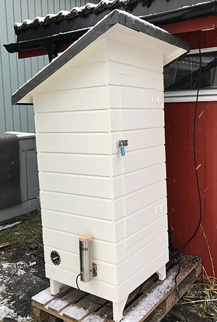

## Introduksjon

Hovedgrunnen til at jeg laget røykskapet var å kunne røyke og speke egne spekepøser av elg, men etter å ha fått det i drift åpner det seg jo en rekke andre muligheter. Siden jeg bor i byen, og har relativt lite plass til å henge spekepølsene, ønsker jeg å bruke skapet til selve spekeperioden også. Derfor ønsker jeg å ha god kontroll med temperatur og luftfuktighet, da disse er viktige parametre for å få et godt resultat. Jeg hadde derfor som mål å kunne avlese disse fra min mobiltelefon over internett. Under utvikling av løsningen kom jeg over en enkel røyksensor, så jeg fant ut at jeg også ville overvåke røyknivået i skapet, og det har vist seg å være veldig praktisk, da jeg kan følge med at røykingen går greit uten å åpne skapet. For å unngå frost har jeg installert et varme-element, som jeg kan styre av og på basert på temperaturen.

Det er mange måter å oppnå det jeg ønsker på, men siden jeg er systemutvikler og over middels interessert i elektronikk, valgte jeg en relativt avansert løsning. Den består av sensorer tilkoblet en programmerbar mikrokontroller (Arduino-liknende) som sender data via wifi til diverse tjenester som gjør at jeg kan lese dem av på forskjellige måter, bl.a. via en vanlig nettleser, på iPhone og til og med på Apple Watch.

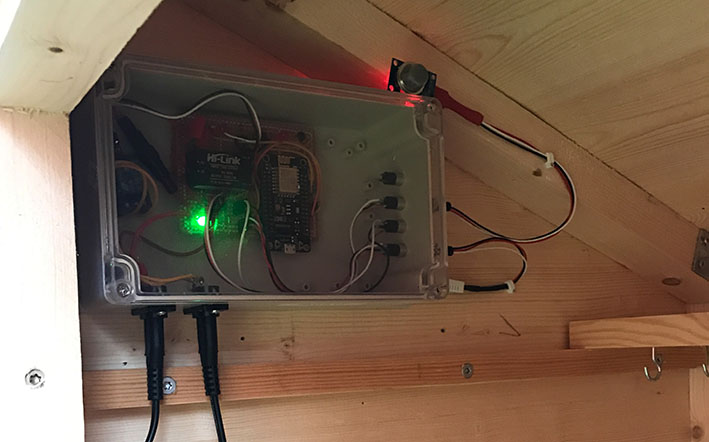

Dette er ikke noe du bare kan kopiere og ta i bruk. Det kreves kunnskap om elektronikk og programmering, og det må loddes, skrues og settes opp en del programvare. Sannsynligvis må du gjøre egne tilpassninger for å få det til, om du ønsker å gjøre noe liknende. Men gøy er det, og om du bare trenger deler av dette kan det være noen tips og idéer å hente her.

## Røykskapet

Selve røykskapet er enkelt. Innvendig er det ca. 65x65 cm, og minste høyde er i overkant av 120 cm. Jeg har designet det selv, men sterkt inspirert av forskjellige bilder i Facebook-gruppa [Røyking av mat](https://www.facebook.com/groups/roykingavmat/). I denne gruppa finnes massevis av nyttige tips for den som er interessert i emnet, og der er mange flinke folk som er ivrige å svare på spørsmål. Men bruk gjerne litt tid på å følge med på det som skrives i gruppa, så får du mange gode tips om ting du kanskje ikke engang har tenkt på.

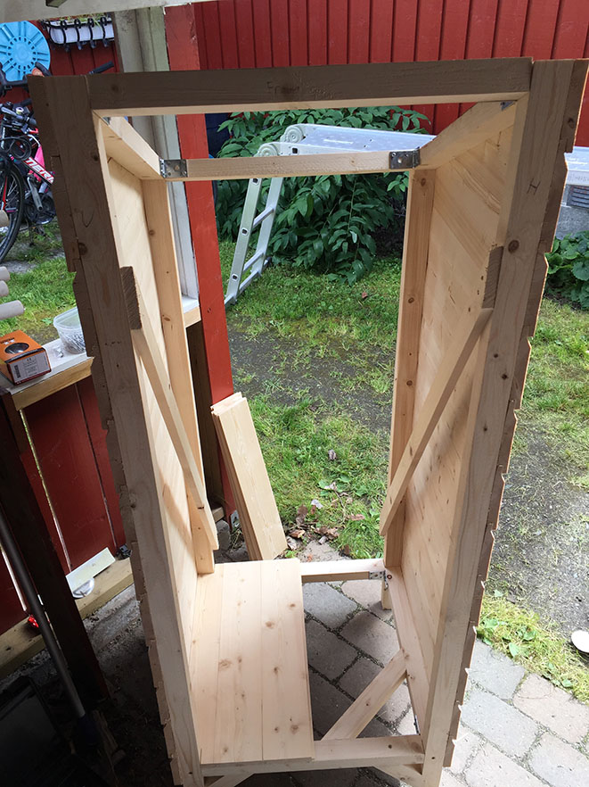

Det jeg i ettertid ønsker jeg hadde gjort anderledes i byggingen, er at jeg skulle ha lagt inn litt isolasjon, slik at det hadde vært lettere å holde det frostfritt. Slik jeg har bygget det forsvinner det meste av varme rett ut, og det krever mye energi å holde temperaturen over 0 når den kryper langt under utenfor.

Denne beskrivelsen handler imidlertid ikke så mye om selve skapet, og heller ikke om selve maten og røykinga. Dette handler om den mer tekniske delen jeg bruker for å overvåke miljøet i skapet.

## Motivasjon

Den konkrete bakgrunnen for hele dette prosjektet er at jeg jakter elg og hjort, og de tre siste årene har forsøkt meg på å lage spekepølser av noe av kjøttet. Pølsene ønsker jeg å røyke, men det har vært litt tungvindt å være avhengig av andre for å få dette gjort. I tillegg trenger jeg et sted der de kan henge i spekeperioden.

En annen viktig motivasjon for meg var å lære noe nytt, og å bygge opp egen kompetanse på såkalt IoT, som betyr "Internet of Things". Dette er et hett tema i min bransje for tiden, og jeg ønsker å kunne mest mulig om dette, slik at jeg skal kunne bruke det også i jobbsammenheng. I tillegg har jeg vært interessert i elektronikk siden jeg var liten gutt, og jeg elsker å designe enkle elektroniske kretser og å lodde dem sammen. Nå for tiden synes jeg det er veldig gøy å jobbe med grensesnittet mellom elektronikk og data, og det å kunne designe enkle brukervennlige løsninger som kan ta signaler fra sensorer og overføre til programvare, samt å kunne styre elektronikk fra programvare.

Det hører også med til historien at vi på arbeidsplassen min, [Itema as](http://itema.no/), jobber kontinuerlig med kompetanseutvikling, og at bl.a. IoT er et viktig tema for tiden. I den forbindelse er det viktig å få prøvd ut mange relevante teknologier. Dette vises godt i arkitekturen, selv om jeg her bare har brukt en liten del av det vi jobber med i Itema.

## Teknisk arkitektur

Nå blir det straks litt mer teknisk. Dette kunne sikkert vært gjort mye enklere, men en viktig motivasjon er altså å få prøvd mye forskjellig teknologi, og å ha det gøy mens man gjør det :-) Her er hoved-trekkene:

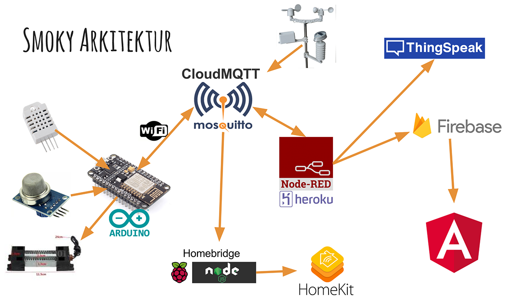

### Hardware

Til venstre ser vi en kombinert sensor for temperatur og luftfuktighet (den hvite), og en røyksensor. Disse blir kontinuerlig avlest av mikroprosessoren. Dette er en NodeMCU, der hovedkomponenten er en ESP8266, som enkelt fortalt er en Arduino med wifi. Arduino er en mikroprosessor som har en rekke innganger og utganger som kan styres fra programvare, og det er relativt enkelt for en programmerer å skrive programvare for dette.

Varmeelementet er også tilkoblet denne via et relé, og programvaren har en såkalt PID-kontroller som skal kunne gi en ganske nøyaktig temperturstyring.

### MQTT

Mikroprosessoren er altså tilkoblet mitt eget trådløse nett, og sender meldinger med sensordata til en meldingskø (MQTT). Dette er en såkalt publish/subscribe-kø, så flere tjenester kan abonnere på data fra denne, og dermed få tilsendt målinger fra sensorene etter hvert som de sendes. Jeg har satt mikroprosessoren opp til å sende ferske måledata hvert halvminutt.

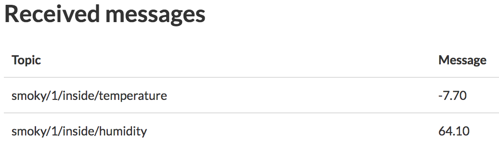

Jeg har to forskjellige steder der jeg har kjørt MQTT. Den ene er en skytjeneste som heter [CloudMQTT](https://www.cloudmqtt.com/). Den andre har jeg kjørt hjemme, på en Raspberry Pi 3, der jeg har installert Mosquitto, som er en såkalt "broker" for MQTT. Begge disse har fungert utmerket, men jeg går vel etter hvert over til å bare bruke min egen, siden jeg da har full kontroll over den. Jeg vil allikevel presisere at CloudMQTT har fungert prikkfritt til alt jeg har trengt den til. Den er dessuten gratis, og det tar bare noen få minutter å komme i gang.

### Node-RED

En av de som mottar data via meldingskøa er et system som heter Node-RED. Dette systemet kan motta meldinger, analysere dem, manipulere dem og sende dem videre til andre tjenester.

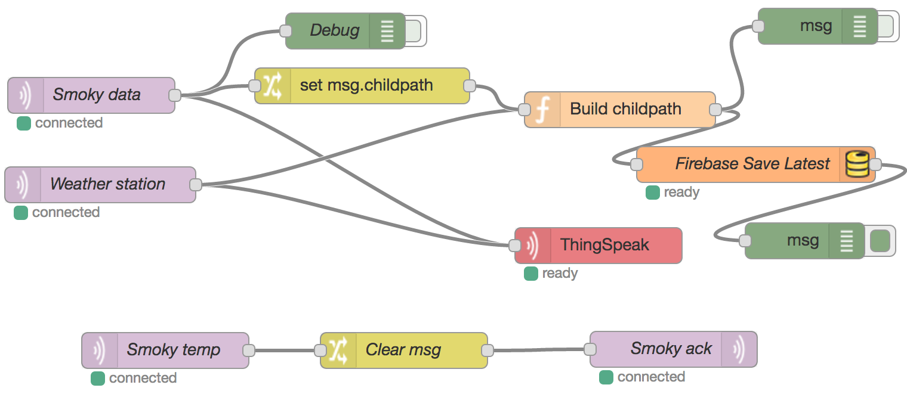

Node-RED gjør det svært enkelt å sy sammen mange forskjellige tjenester. Jeg har prøvd å kjøre Node-RED i en skytjeneste som heter Heroku, som jeg har brukt en del før, men gratisløsningen her er ikke så godt egnet til akkurat dette, så jeg har flyttet denne hjem til en Raspberry Pi, som det står mer om nedenfor.

### ThingSpeak

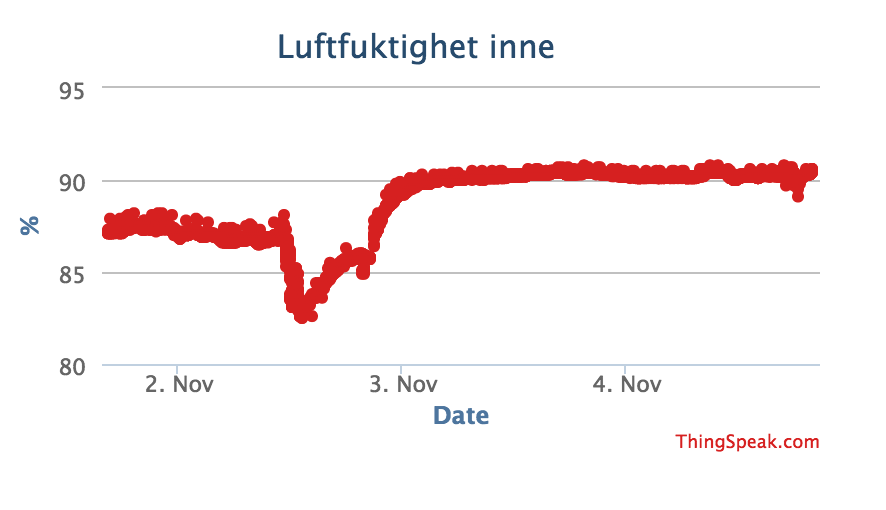

Den første tjenesten Node-RED sender data til er ThingSpeak. Dette er en tjeneste som kan lagre og presentere data grafisk. ThingSpeak kan også brukes til å analysere data og til å ta videre aksjoner basert på analysene, men jeg har bare brukt det til å se på endringer over tid.

### Firebase

Node-RED sender også data til en database som heter Firebase.

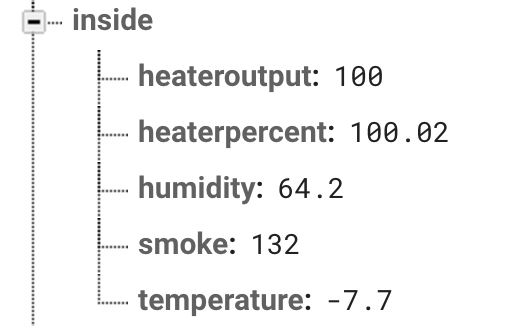

Denne databasen er spesielt godt egnet til f.eks. nettsider der data skal holdes kontinuerlig oppdatert. Jeg har laget en svært enkel nettside ved hjelp av Angular 2, der de viktigste dataene fra sensorene blir kontinuerlig oppdatert. Denne nettsiden kan enkelt vises både på PC og mobiltelefon.

### Angular 2 Webside

Jeg ønsker å kunne ha et sted der jeg kan se sist avleste verdi oppdatert til enhver tid. Derfor har jeg laget en helt enkel app som ved hjelp av Angular 2 viser kontinuerlig oppdaterte tall fra Firebase.

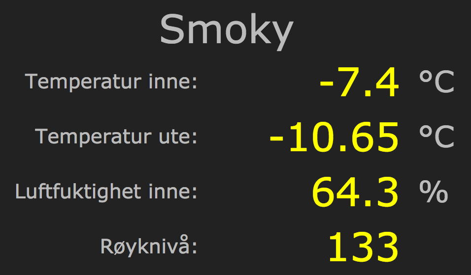

Det går ikke mange sekunder fra avlesningen er gjort i røykskapet til verdien vises på websiden.

### Homekit

For mobiltelefoner finnes det også andre muligheter. På iPhone er det f.eks. noe som heter Homekit. Dette er Apple sin platform for hjemme-automasjon. Via Homekit kan man både lese av data fra sensorer rundt i huset, og man kan styre lys, varme og annet via fjernstyrte brytere, dimmer osv.

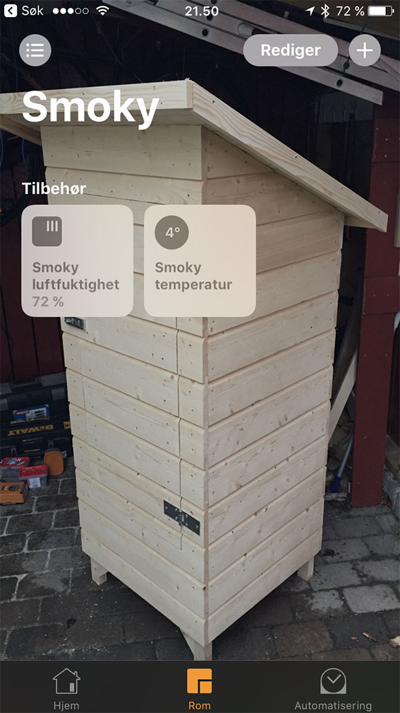

Å integrere med Homekit kan være ganske krevende, men det finnes også enkle løsninger man kan bruke for å få til noe. Jeg har brukt en løsning som heter Homebridge. Denne kjører jeg på en Raspberry Pi 3, som er en liten, enkel og rimelig datamaskin. Homebridge gjør sensordataene mine tilgjengelig for Homekit, slik at jeg kan lese dem av på iPhone og Apple Watch. Siden jeg har en Apple TV hjemme kan jeg også lese av verdier i Homekit når jeg ikke er hjemme.

### Værstasjon

Som om ikke dette var nok, har jeg koblet til værstasjonen min også, slik at jeg kan avlese bl.a. temperatur og luftfuktighet ute via de samme løsningene.

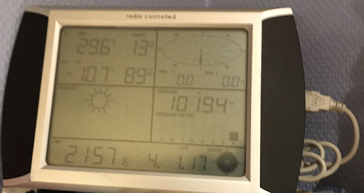

Værstasjonen har USB-grensesnitt og er koblet til den samme Raspbery Pi-en. Denne kjører en progrmvare som heter weewx, som sender data både til meldingskøa og til en værtjeneste som heter Weather Underground. Via meldingskøa og Node-RED lagrer jeg utendørstemperatur også i Firebase, slik at jeg kan vise den på nettsida.

## Elektronikken

Her er et slags bilde av elektronikken, tegnet med Fritzing. Fritzing er et interessant verktøy, men det er langt fra feilfritt og perfekt, og ganske knotete til en del ting. Jeg kunne sikkert gjort det mye bedre, men jeg tegnet bare akkurat nok til å ha en plan for byggingen.

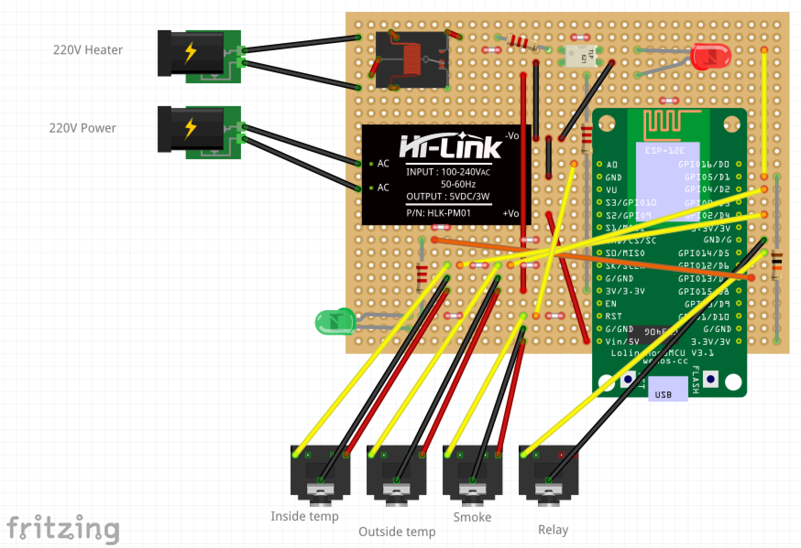

Jeg har brukt et stripboard med horisontale striper. Kunne ikke bruke det i Fritzing, for da gikk alt i sirup. Derfor feil bilde. De hvite "ledningene" indikerer hvor banene må kuttes. I tillegg er det kuttet midt under prosessorkortet og midt under Hi-Linken.

Den sorte greia oppe til venstre er et relé. Den hvite saken med 4 ben er en optokobler. Den brukes for å gi 5V til reléet. Utgangene på prosessoren gir bare 3,3V. Inngangene tåler heller ikke mer enn 3,3V.

Jeg vil forresten ikke anbefale å bruke stripboard for dette. I alle fall ikke den svært billige varianten jeg fikk fra Ebay. Banene var elendige, og løsnet for det minste ytre press, så jeg har måttet lodde over omtrent alle banene der det skulle være kontakt.

Jeg garanterer ikke at dette er helt riktig og helt oppdatert, men det gir en idé. Du må uansett ha rikelig med elektronikk-kompetanse for å gjøre dette selv.

All elektronikken får du kjøpt billig fra Ebay. Prosessoren koster under 30 kroner. De andre delene er vel enda billigere, bortsett fra selve boksen som kostet nærmere 100 kroner, kanskje mer.

Akkurat denne mikroprosessoren er veldig godt egnet av flere årsaker:

* Den inneholder en ESP8266, som er en mokroprosessor kombinert med wifi.
* Den er Arduino-kompatibel og kan lett programmeres med Arduino IDE.
* Den kan lett programmeres via USB-kabel, i motetning til mange andre som krever FTDI-adapter og en del mer koblinger.
* Den kan forsynes med 5V, og kan levere 3,3V. Inngangene og utgangene er beregnet på 3,3V.
* Den kan programmeres med LUA script, men jeg har brukt C++.
* Den krever ingen spesielle koblinger til VCC eller GND under kjøring, slik som mange av de enklere variantene av ESP8266.

## Deleliste

Her er en oversikt over de viktigste komponentene i systemet:

Komponent             | Beskrivelse
--------------------- | ---------------------------------
Mikroprosessor        | NodeMCU ESP8266
Sensor for temperatur og luftfuktighet | DHT22
Røyksensor            | MQ-2
Værstasjon            | Denne er kjøpt på Clas Ohlson, og finnes nok i mange forskjellige merker, men ser ut for å være vanlig under betegnelsen "Fine Offset WH1028".
Strømforsyning        | Her er det mange muligheter, bare du får 5V og over 300mA, men jeg bruker en som heter Hi-Link HLK-PM01.
Varmeelement          | 100W 220V. Har ikke konkret betegnelse. Dette er uansett ikke stort nok til å holde et uisolert skap frostfritt. Det kan dessuten være en god idé å bruke et større element, slik at man kan varmrøyke.
Server                | Raspberry Pi 3 som kjører Ubuntu Mate.

I tillegg er det noen motstander, lysdioder og forskjellig annet i boksen.

Noen lurer på hva slags enhet røyken måles i. Denne målingen gir ingen enhet. Den gir bare ut en spenning mellom 0 og 5 V, der 0 er minst og 5V er mest røyk. Denne detekteres så med den analoge inngangen på mikroprosessoren, der den gjøres om til et tall mellom 0 og 1023. Det er dette tallet som vises. Det ser dessuten ikke ut som jeg bruker hele skalaen. Den analoge inngangen skal forresten bare ha spenning mellom 0 og 1V, så her bør det være en spenningsdeler. Det har jeg ikke, men så lenge verdiene er under 1023 skal det ikke være noe problem. Jeg har ikke hatt verdier over 800 hittil.

## Røyken

Jeg kan jo ta med litt om det viktigste med hele skapet, nemlig røyken. Jeg kjøpte meg en Smokai, 1 liters, fordi jeg syntes den så genialt enkel ut.

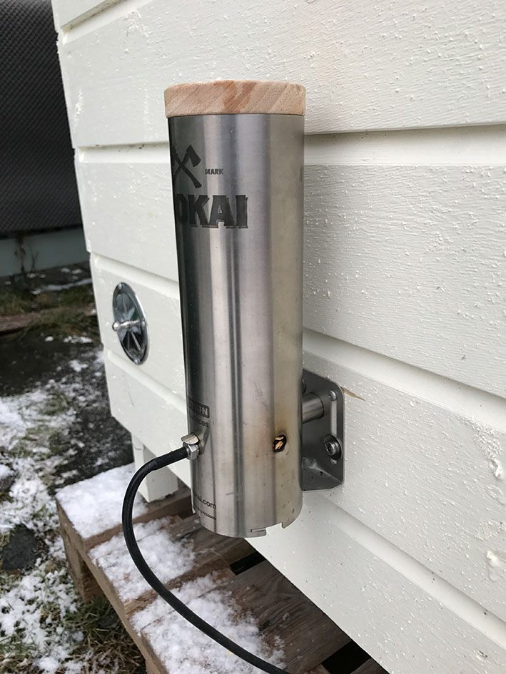

Det er den jo også, men jeg har jo i ettertid lest en del om at man kan bli blaget med sur røyk og sterk usmak. Det har jeg unngått, og har nok forklaringen her. Poenget, slik jeg har forstått det, er å ha rikelig med lufting, slik at røyken byttes ut hele tiden.

### Byrøyking

Jeg fikk imidlertid et annet problem. Jeg bor i byen, og det er trangt mellom husene. Jeg fyrte opp for første gang en fredags kveld i fjor høst, med flere hjerter og kjøttstykker av elg og hjort i skapet.

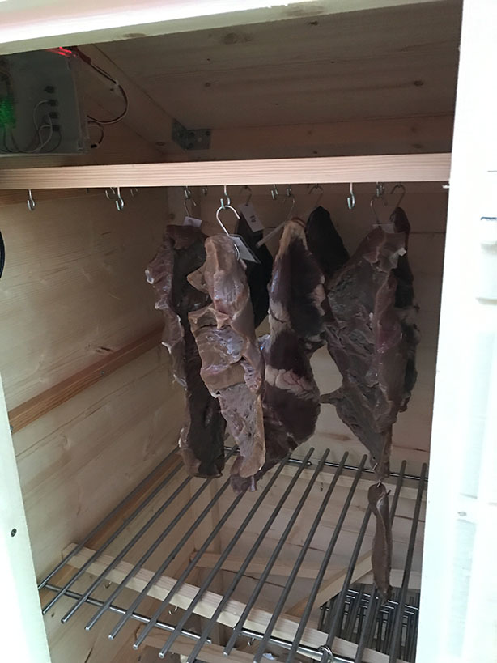

Alt gikk kjempefint. Jeg satt inne i godstolen og fulgte med på røyknivået via mac-en, mens jeg feiret med ei flaske Alstadberger, et herlg kraftig røkt Stjørdalsøl fra Klostergaarden.

Etter to timer kom nabokona og ringte på døra. Hun hadde fått masse røyk inn i huset, til tross for at jeg varslet henne på forhånd slik at hun fikk stengt ventilene. Og hun var i tillegg kraftig allergisk, og fikk pustevansker av røyken. Sånn kan man jo ikke ha det, så her måtte det mer utvikling til.

Det endte med ei PC-vifte på innsida, et sluk fra Biltema på utsida, et par overganger fra Jula, og deretter en 13m lang 32mm tykk slange som gikk opp på taket.

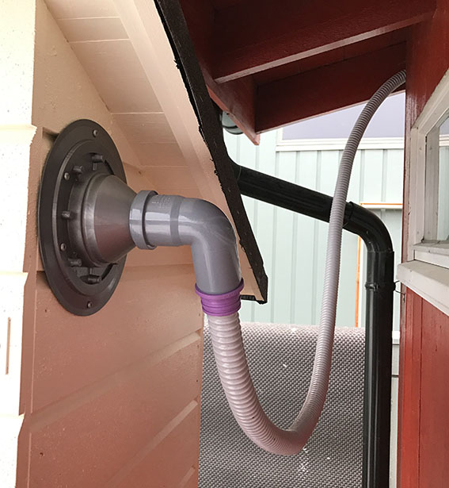

På taket slippes røyken ut ved værstasjonen, på høyde med pipa. Dette har fungert så fint at jeg praktisk talt ikke kjenner røyklukt på bakkenivå.

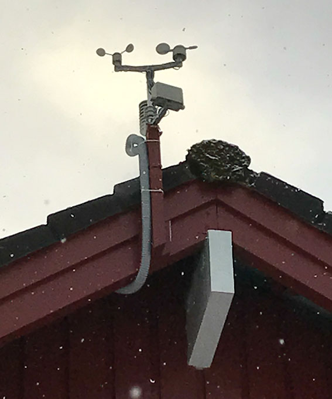

PC-vifta kan hastighetsreguleres fra mikroprosessoren. Akkurat denne delen har jeg ikke fått ferdig enda, men det kommer nok snart.

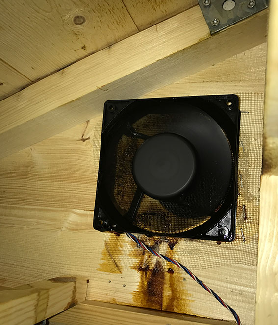

Planen er å kunne styre litt lett lufting til vanlig, og mer under røykingen. Jeg har også planer om å ha en ekstra vifte som sirkulerer lufta inne i skapet, da det er viktig for å hindre muggdannelse. Til dette har jeg brukt ei enkel vifte fra Clas Ohlson, men den bråka så pass mye at jeg vil bytte den ut med ei PC-vifte der jeg kan regulere hastigheta.

Nå blir det nok bevegelse i lufta med avtrekksvifta, men jeg tenker jeg kan justere ned på den for å spare energi til oppvarmingen, og heller sirkulere lufta inni skapet.

## Koden

Hele systemet består av tre helt forskjellige deler som har hver sin programvare:

* [**smoky-box**](https://github.com/ottopaulsen/smoky-box) - kode for mikroprosessoren i skapet.
* [**smoky-node-red**](https://github.com/ottopaulsen/smoky-node-red) - mer konfigurasjon enn kode.
* [**smoky-view**](https://github.com/ottopaulsen/smoky-view) - Angular 2 prosjektet som viser data på nettside.

Du kan finne koden til hver av disse i egne prosjekt (følg linkene ovenfor). Se beskrivelse av dem nedenfor.

### smoky-box

For en programmerer skal koden være grei å forstå, men dette prosjektet bør ikke være ditt første Arduino-prosjekt. Har du ikke kodet for Arduino før, start med noen enklere eksempel. Det finnes tusenvis av dem.

Som enkel Arduino-kode ofte er, er også denne delt i tre hoved-deler:

* Definisjoner og deklareringer, der man finner globale data
* setup() der man finner kode for initiering av systemet. Denne kjører en gang når systemet starter.
* loop() der man finner den koden som gjør hovedjobben. Denne går i en evig løkke og gjennomfører alle oppgavene kontinuerlig.

Noe av koden er skilt ut i egne metoder (funksjoner), i hovedsak for å gjøre koden ryddigere, men noen ganger for at samme kode brukes fra flere steder.

Innenfor hver hoveddel finner man kode for de forskjellige funksjonene jeg har bygget inn:

* Wifi
* MQTT
* Røyksensor
* Sensor for temperatur og luftfuktighet
* Styring av varmeelementet
* Oppdatering OTA (over the air)
* Viftestyring (uferdig)
* Styring av lysdioder

Kommentarer som overskrift gjør det lett å finne hver enkelt del av koden, om du bare ønsker å bruke noe av det.

I tillegg til å sende data ut av skapet bruker jeg også meldingskøa (MQTT) til å sende meldinger tilbake til skapet. Foreløpig kan jeg styre:

* Innstilt tempertur
* p, i og d verdier for PID-kontrolleren
* Viftehastighet (uferdig)

I tillegg sender jeg et "ack" tilbake til skapet for at lysdioden skal indikere at meldinger er korrekt overført. Denne blinker grønt nå en melding er sendt, men når ack er mottatt lyser den konstant helt til neste gang melding sendes (hvert halvminutt).

Hvis du ser nøye etter kan du også finne kode som handler om "DHT lesefeil". Det skyldes at jeg av og til opplever problemer med avlesing av sensoren for temeratur og luftfuktighet (DHT22). For å kunne følge med på det har jeg kode som detekterer disse feilene og sender informasjon om antall feil som har oppstått, på meldingskøa.

Det er en kodefil som mangler: `settings.h`. Denne inneholder passordene mine. De får du ikke. Det står øverst i koden hvilke konstanter som forventes.

Du finner Arduino-koden på mitt [smoky-box](https://github.com/ottopaulsen/smoky-view) prosjekt.

### smoky-node-red

Node-RED er et system som gjør det lett å sy sammen IoT-tjenester. Jeg bruker det til å utveksle meldinger mellom mikroprosessoren i røykskapet og de andre tjenestene jeg bruker.

For den som er interessert, og som er datakyndig nok til å få til resten av det jeg beskriver her, er det veldig greit og enkelt å ta i bruk Node-RED. Den største utfordringen er kanskje å finne ut hvor du skal kjøre det, for det er jo et system som skal kjøre kontinuerlig.

Jeg har prøvd å kjøre Node-RED i skyen, på en tjeneste som heter Heroku. Der kan man få noe prosessorkapasitet gratis, men gratisversjonen har den ulempen at den "sovner" dersom den ikke blir brukt. Med litt triksing fikk jeg den til å holde seg våken, men av og til sviktet dette, og da stoppet den opp. Dessuten var det en del utfordringer med både å få det til å kjøre, samt å få til å ta vare på endringer man gjør i brukergrensesnittet. Det er fullt mulig å få dette til, men altså en del jobb å sette opp riktig.

Jeg endte derfor opp med å kjøre denne hjemme på en Raspberry Pi 3. Raspberry Pi er en bitteliten veldig billig datamaskin. Du kan få en komplett maskin med rikelig lagringsplass og innbyggingsboks for rundt 500 kroner. Du kan velge mellom mange forskjellige operativsystem som kan kjøre på denne maskinen. Jeg har valgt [Ubuntu Mate](https://ubuntu-mate.org/), mest fordi jeg er godt kjent med Ubuntu, som er en Linux-variant.

Det er enkelt å installere de tjenestene du vil på Ubuntu. Her finnes det massevis av oppskrifter. De tjenestene jeg bruker for denne løsningen er:

* Node.js (Platform for andre tjenester)
* Mosquitto (MQTT meldingskø)
* Node-RED (IoT orkestrering)
* Homebridge (Homekit-kobling)
* Weewx (For værstasjonen)

Du finner mer informasjon på mitt [smoky-node-red](https://github.com/ottopaulsen/smoky-node-red) prosjekt.

### smoky-view

Jeg har laget et enkelt system der jeg bruker [Angularfire 2](https://github.com/angular/angularfire2), som gjøre det lett å kombinere Angular 2 og Firebase. Dette kan jeg ikke så mye om, men jeg har fulgt oppskriften og fått det til å virke. Det meste av koden min er skrevet i Typescript, i tillegg til litt html, css og noe konfigurasjon.

Om du kan javascript så skal du greit kunne finne ut av dette. Hvis ikke, er jeg uansett ikke den rette til å lære det bort.

Github-prosjeket mitt heter [smoky-view](https://github.com/ottopaulsen/smoky-view).

## Linker

Her skal du kunne finne det meste av viktig informasjon jeg har brukt.

[AngularFire2](https://github.com/angular/angularfire2)
[Angular](https://angular.io/)
[Arduino client for MQTT](http://pubsubclient.knolleary.net/index.html)
[Arduino](https://www.arduino.cc/)
[CH340 driver](https://www.wemos.cc/downloads/) som du trenger for å programmere NodeMCU
[CloudMQTT](https://www.cloudmqtt.com/)
[DHT22 Datablad](https://www.sparkfun.com/datasheets/Sensors/Temperature/DHT22.pdf)
[DHT22 Library](http://playground.arduino.cc/Main/DHTLib)
[Firebase](https://firebase.google.com/)
[Heroku](https://www.heroku.com/)
[Homebridge](https://github.com/nfarina/homebridge)
[Homekit](http://www.apple.com/ios/home/)
[Homie convention](https://github.com/marvinroger/homie) (Litt interessant, men ikke viktig her.)
[Integrering med Homekit](https://github.com/Itema-as/smoky/blob/master/doc/Homekit.md)
[Itema as](http://itema.no/)
[MQ-2](http://www.instructables.com/id/How-to-use-MQ2-Gas-Sensor-Arduino-Tutorial/)
[MQTT](http://mqtt.org/)
[Mosquitto](https://mosquitto.org/)
[Node-RED ThingSpeak node](https://github.com/clough42/node-red-contrib-thingspeak42)
[Node-RED](http://nodered.org/)
[NodeMCU](https://github.com/nodemcu/nodemcu-devkit)
[OTA Update av ESP8266](http://esp8266.github.io/Arduino/versions/2.0.0/doc/ota_updates/ota_updates.html) Jeg bruker [Web browser varianten](http://esp8266.github.io/Arduino/versions/2.0.0/doc/ota_updates/ota_updates.html#web-browser)
[PID Introduksjon](http://brettbeauregard.com/blog/2011/04/improving-the-beginners-pid-introduction/)
[PID Library](http://playground.arduino.cc/Code/PIDLibrary) for Arduino
[Raspberry Pi](https://www.raspberrypi.org/)
[Røyking av mat på Facebook](https://www.facebook.com/groups/roykingavmat/)
[ThingSpeak](https://thingspeak.com/)
[Ubuntu Mate](https://ubuntu-mate.org/)
[WeeWX](http://www.weewx.com/)